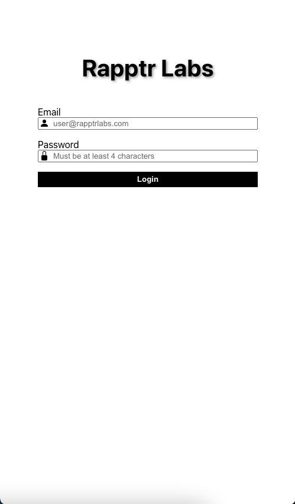
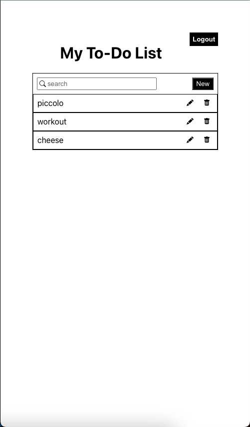
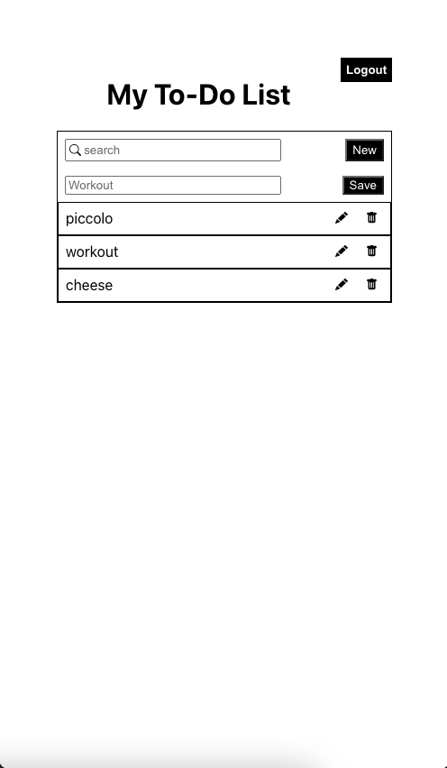

# <h1 align="center"> React Login List</h1>
 #### <h3 align="center">https://github.com/allenaxie/react-login-list</h3>
 <h5 align="center">Allen Xie</h5>

 

## 📝 Description

React Login List is a React web application developed for Rapptr Labs Test. I spent a few hours on this project. Unfortunately, I was not able to completely customize the error validation on the login form.

## 📸 Screenshots 

| | | |
|:-------------------------:|:-------------------------:|:-------------------------:|
| |  |  

## 💻 Technologies Used 

- HTML
- CSS
- JavaScript
- TypeScript
- React
- React icons
- Sass

